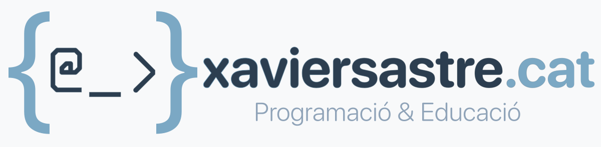

<figure style="text-align: center;">
  
</figure>

# Spring Boot Codespaces Template

Aquest repositori és una plantilla mínima per fer exercicis amb Spring Boot a GitHub Codespaces.

Requeriments:
- Recomanat: utilitzar GitHub Codespaces (prebuilds opcional).
- Opcional: Maven local o usar el wrapper (recomanat incloure mvnw).

Com obrir amb Codespaces:
1. A GitHub: Code → Open with Codespaces → Create codespace on main.
2. Al terminal del Codespace:
    - Executa: ./mvnw spring-boot:run   (o `mvn spring-boot:run` si tens Maven local)
    - L'aplicació iniciarà a http://localhost:8080
3. A la vista de Ports de Codespaces, obre el port 8080 amb "Open in Browser".

Endpoints d'exemple:
- GET /api/hello → retorna text.
- GET /api/greet?name=Anna → retorna JSON: { "message": "Hola, Anna!" }

